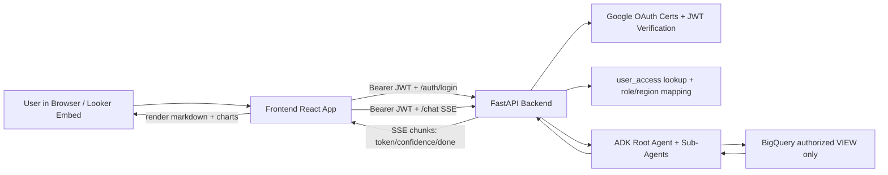
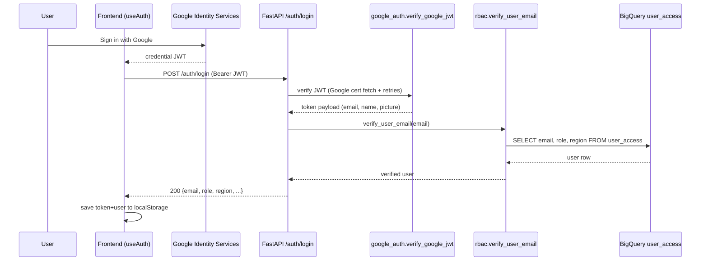
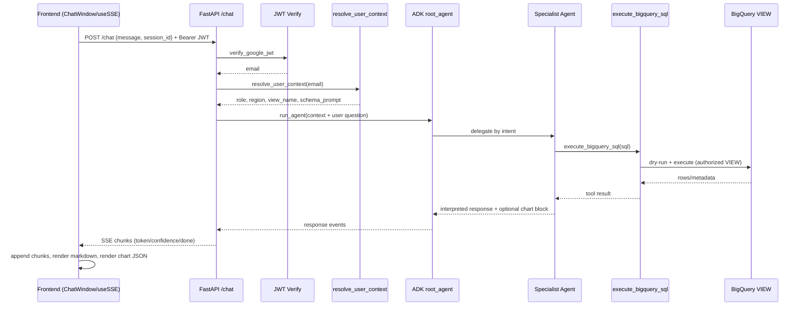

# Analytics Chatbot Architecture

This document describes the current system architecture, available agents, and the full runtime flow from login to answer streaming.

## 1) High-Level Architecture

The application has two major parts:

- `frontend` (React + Vite + Tailwind): Google sign-in, chat UI, chart rendering, SSE client.
- `backend` (FastAPI + Google ADK + BigQuery): auth/RBAC, agent orchestration, SQL execution, streaming responses.

### Component Diagram

## 2) Key Backend Modules

- `backend/main.py`
  - Exposes `POST /auth/login`, `POST /chat`, `GET /health`.
  - Runs request logging middleware.
  - Streams chat responses using SSE.

- `backend/auth/google_auth.py`
  - Verifies Google ID token from `Authorization: Bearer <JWT>`.
  - Uses pooled HTTP transport + retry logic while fetching Google certs.
  - Returns `401` for invalid JWT and `503` for temporary upstream verification failures.

- `backend/auth/rbac.py`
  - Reads `user_access` table in BigQuery.
  - `verify_user_email`: existence check for login.
  - `resolve_user_context`: maps `(role, region)` to one authorized view via `VIEW_MAP`.

- `backend/agents/adk_agents.py`
  - Builds ADK root orchestrator and specialist sub-agents.
  - Injects strict privacy/scope prompt blocks.
  - Streams deduplicated text deltas to avoid repeated paragraphs in the UI.
  - Handles 429/rate-limit model errors with clearer user messaging.

- `backend/tools/bigquery_tool.py`
  - Tool callable by ADK agents.
  - Performs SQL dry-run first, then execute.
  - Truncates very large result sets to `BQ_TOOL_MAX_ROWS` before returning to model context.

## 3) Agents We Have

Defined in `backend/agents/adk_agents.py`:

1. `root_agent`
   - Orchestrator.
   - Routes each question to the most appropriate specialist agent.

2. `sql_analytics_agent`
   - For totals, counts, top-N, grouped breakdowns.
   - Generates BigQuery SQL, calls tool, summarizes with numbers.

3. `trends_agent`
   - For time-series and period-over-period questions.
   - Emphasizes date grouping and trend interpretation.

4. `rca_agent`
   - For "why did it change?" analysis.
   - Finds contributors and comparative deltas.

5. `conversational_agent`
   - For greetings/out-of-scope/probing questions.
   - No tool usage; provides safe conversational replies/refusals.

## 4) Login Flow (Frontend + Backend)

### Summary

- Frontend receives Google credential JWT.
- Backend verifies JWT + checks user in BigQuery `user_access`.
- Frontend stores session in `localStorage` for persistence (embed-friendly).

### Sequence

### Session Persistence (Current)

- Key: `analytics-chatbot-auth-v1`
- Stored: `token`, `user`, `savedAt`.
- On app load:
  - If local session exists, frontend restores immediately.
  - Frontend re-validates token via `/auth/login` in background.
  - If re-validation fails, storage/state is cleared.

This supports embedding scenarios (e.g., Looker Studio iframe) where reloads happen often.

## 5) Question/Answer Flow (Chat Runtime)

### Summary

1. Frontend sends question to `/chat` with JWT and `session_id`.
2. Backend re-verifies JWT and resolves RBAC context.
3. `run_agent()` builds prompt context with authorized view + schema.
4. Root agent routes to a specialist.
5. Specialist may call `execute_bigquery_sql`.
6. Backend streams chunks to frontend via SSE.
7. Frontend progressively renders markdown + chart blocks.

### Sequence

## 6) Security and Data Scope Guardrails

- JWT required on both `/auth/login` and `/chat`.
- RBAC is enforced by mapping user `(role, region)` to one predefined view.
- Agent prompts explicitly forbid:
  - querying other tables/views/datasets/projects,
  - revealing internal schema/access internals,
  - bypassing controls.
- BigQuery access is constrained by using authorized views.

## 7) Charting Support

The frontend chart renderer supports these chart types:

- `bar`
- `horizontal_bar`
- `line`
- `area`
- `pie`
- `scatter`
- `stacked_bar`
- `composed`

The agents are prompted to choose chart type based on result shape and only include chart blocks when useful.

## 8) Error Handling (Current)

- Auth/network issues during Google cert fetch:
  - Backend returns `503` for temporary verification failures.
  - Frontend error banner maps to user-friendly "Service Temporarily Unavailable".
- Model rate-limit (`429 RESOURCE_EXHAUSTED`):
  - Backend detects and emits a targeted retry message.
- SSE stream issues:
  - Backend emits stream error chunk and `done`.
  - Frontend shows contextual error banner.

## 9) Important Runtime Notes

- ADK sessions are in-memory (`InMemoryRunner` / in-memory session service).
  - Good for POC/dev.
  - Not durable across backend restarts.
- Frontend auth persistence is localStorage-based for now, as requested for embed use.

